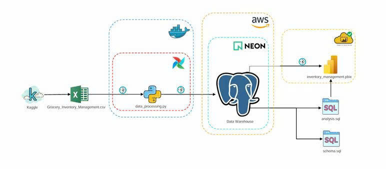

# 🛒 Grocery Inventory Management Analytics: End-to-End Data Analytics Pipeline

## ✒️ 1. Giới thiệu về tác giả

- **Tên:** Nguyễn Khắc Hưng
- **Vị trí:** Data Analyst/Analytics Engineer
- **Học Vấn:** Đang theo học trương trình kỹ sư nghành Khoa Học Dữ Liệu, chuyên nghành Phân Tích Dữ Liệu trong kinh tế và tài chính, thuộc khoa Công Nghệ Thông Tin, Đại học Mỏ-Địa Chất

---

## 🌟 2. Tổng quan về dự án

Đây là dự án phân tích dữ liệu end-to-end được xây dựng sát với hệ thống phân tích dữ liệu trên thực tế doanh ngiệp nhất, thể hiện kỹ năng thực chiến doanh nghiệp của tác giả dự án. Dự án thuộc domain về **Logistics and Supply Chain**. Dữ liệu dự án được thu thập từ trang **Kaggle** bao gồm 989 dòng và 10 cột.

Dự án tiến hành xử lý dữ liệu bằng **Python** và tự động hóa quy trình xử lý dữ liệu hàng ngày bằng **Apache Airflow**, sau đó dữ liệu được đổ vào data warehouse xây dựng bằng **PostgreSQL** chạy trên **AWS** do nền tảng **Neon** cung cấp. Tiến hành phân tích dữ liệu bằng **SQL**, trả lời những câu hỏi kinh doanh, đưa ra insight và **recommendations**. Dựa vào những insight và **recommendation** vừa phân tích bên trên xây dựng dashboard theo dõi tình hình vận hành và những vấn đề của dữ liệu bằng **Power BI Desktop**, dữ liệu được kết nối trực tiếp từ data warehouse, sau đó tự động hóa quá trình cập nhật dữ liệu lên dashboard hàng ngày thông qua **Power BI Cloud Service**.

---

## 🏗️ 3. Kiến trúc dự án

<p align="center">
  
</p>

**Giải thích kiến trúc và mô tả luồng hoạt động:** Trong ảnh kiến trúc của dự án phân tích dữ liệu quản lý hàng tồn kho:

- **Luồng 1:** Dữ liệu được tải về từ trang cung cấp các bộ dữ liệu uy tín là kaggle và lưu dưới định dạng file `.csv`
- **Luồng 2:** Sử dụng Python (file `data_processing.py`) để trích xuất dữ liệu từ file `.csv`, sau đó xử lý dữ liệu bao gồm dữ liệu thiếu, dữ liệu trùng lặp, dữ liệu ngoại lai, chuyển đổi kiểu dữ liệu, và nạp dữ liệu vào data warehouse. Tự động hóa quy trình xử lý dữ liệu này bằng **Apache Airflow** chạy trên môi trường được setup bằng **Docker**.
- **Luồng 3:** Data warehouse được xây dựng bằng **PostgreSQL** chạy trên cloud **AWS Asia Pacific 1 Singapore** (nền tảng điện toán đám mây do Amazon cung cấp với tên là AWS) thông qua công ty cung cấp giải pháp **Neon.tech**
- **Luồng 4:** Sau khi đã có data warehouse ta tiến hành phân tích dữ liệu bằng **SQL**, sử dụng **VS Code** với extension **SQLTools** để kết nối trực tiếp đến data warehouse đang chạy trên cloud để phân tích.
- **Luồng 5:** Xây dựng dashboard theo dõi trên **Power BI Desktop** dựa vào các insights đã tìm được trong bước phân tích dữ liệu bằng **SQL**. Tự động hóa quy trình cập nhật dữ liệu cho dashboard thông qua **Power BI Cloud Service**.

---

## 🛠️ 4. Tech Stack

- **IDE:** Visual Studio Code
- **Programming Languages:** Python, SQL, DAX
- **Libraries/Frameworks:** Pandas, NumPy, Matplotlib, Seaborn, Scikit-Learn, os, SQLAlchemy
- **Database & Data Warehouse:** PostgreSQL, Neon.tech
- **Orchestration (Automation):** Apache Airflow
- **Containerization:** Docker
- **Business Intelligence (BI):** Power BI Desktop, Power BI Cloud Service
- **Cloud Platform:** Amazon Web Services (AWS)

---

## 📊 5. Tổng quan về dữ liệu

Tập dữ liệu tên là `grocery_inventory.csv` được thu thập trên trang cung cấp dữ liệu **Kaggle** với thông tin tập dữ liệu như sau:

- **Rows:** 989
- **Columns:** 10
- **Key Features:**
  - **Date information:** `date_received`, `last_order_date`, `expiration_date`
  - **Product information:** `Product_id`, `Product_name`, `Category`
  - **Supplier information:** `Supplier_id`, `supplier_name`
  - **Warehouse information:** `warehouse_locations`
  - **Inventory status:** `Status`

---

## 🔍 6. SQL Analytics _(see details in the [reports.pdf](reports/reports.pdf) file in the [reports](reports) folder)_

### 6.1. Product Count by Category

```sql
CREATE VIEW statistical_category AS
SELECT
    catagory,
    COUNT(*) AS total
FROM grocery_inventory_table
GROUP BY catagory
ORDER BY total DESC;

SELECT * FROM statistical_category;
```

#### 📋 Output Table:

| `catagory`              | `total` |
| :---------------------- | ------: |
| **Fruits & Vegetables** |   `331` |
| **Dairy**               |   `180` |
| **Grains & Pulses**     |   `162` |
| **Seafood**             |    `90` |
| **Oils & Fats**         |    `77` |
| **Beverages**           |    `75` |
| **Bakery**              |    `74` |

#### 📈 Visualization:

<p align="center">
  
</p>

### 6.2. Expiration Risk Analysis (Within the Next 30 and 60 Days)

```sql
CREATE VIEW vw_inventory_shelf_life_analysis_ AS
WITH expiration_analysis AS (
    SELECT
        *,
        expiration_date - date_received AS shelf_life_days
    FROM grocery_inventory_table
),
expiration_labels AS (
    SELECT
        *,
        CASE
            WHEN shelf_life_days < INTERVAL '30 days' AND shelf_life_days >= '0 days' THEN '30 days'
            WHEN shelf_life_days >= INTERVAL '30 days' AND shelf_life_days < INTERVAL '60 days' THEN '30 - 60 days'
            ELSE '> 60 days'
        END AS labels_expiration
    FROM expiration_analysis
)
SELECT * FROM expiration_labels;

-- Expiration risk statistics by Category
SELECT
    catagory,
    SUM(CASE WHEN labels_expiration = '30 days' THEN 1 ELSE 0 END) AS total_expiring_30_days,
    SUM(CASE WHEN labels_expiration = '30 - 60 days' THEN 1 ELSE 0 END) AS total_expiring_60_days
FROM vw_inventory_shelf_life_analysis_
GROUP BY catagory;

-- Expiration risk statistics by Warehouse Location
SELECT
    Warehouse_Location,
    SUM(CASE WHEN labels_expiration = '30 days' THEN 1 ELSE 0 END) AS total_expiring_30_days,
    SUM(CASE WHEN labels_expiration = '30 - 60 days' THEN 1 ELSE 0 END) AS total_expiring_60_days
FROM vw_inventory_shelf_life_analysis_
GROUP BY Warehouse_Location;
```

#### 📋 Output Table (Expiration risk statistics by Category):

| `catagory`              | `total_expiring_30_days` | `total_expiring_60_days` |
| :---------------------- | -----------------------: | -----------------------: |
| **Bakery**              |                      `4` |                      `5` |
| **Fruits & Vegetables** |                     `27` |                     `27` |
| **Oils & Fats**         |                      `4` |                      `7` |
| **Dairy**               |                     `14` |                     `15` |
| **Seafood**             |                      `7` |                      `7` |
| **Grains & Pulses**     |                      `8` |                     `17` |
| **Beverages**           |                      `6` |                      `5` |

#### 📈 Visualization:

<p align="center">
  
</p>

### 6.3. Supplier Performance Ranking

**Business Question:** Filter out the Top 3 suppliers with the most _Active_ items, and the Top 3 suppliers with the most _Discontinued_ items.

```sql
CREATE VIEW supplier_status_ranking_view AS
WITH supplier_status_summary AS (
    SELECT
        Supplier_Name,
        COUNT(*) FILTER(WHERE status_ = 'Discontinued') AS total_Discontinued,
        COUNT(*) FILTER(WHERE status_ = 'Active') AS total_Active
    FROM grocery_inventory_table
    GROUP BY Supplier_Name
),
supplier_status_ranking AS (
    SELECT
        *,
        RANK() OVER (ORDER BY total_Discontinued DESC) AS total_Discontinued_rank,
        RANK() OVER (ORDER BY total_Active DESC) AS total_Active_rank
    FROM supplier_status_summary
)
SELECT * FROM supplier_status_ranking;

-- Filter Top 3 Active suppliers
SELECT * FROM supplier_status_ranking_view
WHERE total_Active_rank <= 3;

-- Filter Top 3 Discontinued suppliers
SELECT * FROM supplier_status_ranking_view
WHERE total_Discontinued_rank <= 3;
```

#### 📋 Output Table (Filter Top 3 Active suppliers):

| `Supplier_Name`  | `total_Discontinued` | `total_Active` | `total_Discontinued_rank` | `total_Active_rank` |
| :--------------- | -------------------: | -------------: | ------------------------: | ------------------: |
| **Feedfire**     |                  `0` |            `4` |                     `226` |                 `1` |
| **Quatz**        |                  `2` |            `4` |                      `20` |                 `1` |
| **Quinu**        |                  `1` |            `4` |                      `85` |                 `1` |
| **Rhyloo**       |                  `0` |            `4` |                     `226` |                 `1` |
| **Shuffledrive** |                  `1` |            `4` |                      `85` |                 `1` |

#### 📈 Visualization:

<p align="center">
  
</p>

<br/>

#### 📋 Output Table (Filter Top 3 Discontinued suppliers):

| `Supplier_Name` | `total_Discontinued` | `total_Active` | `total_Discontinued_rank` | `total_Active_rank` |
| :-------------- | -------------------: | -------------: | ------------------------: | ------------------: |
| **Skipfire**    |                  `5` |            `1` |                       `1` |                `77` |
| **Devshare**    |                  `4` |            `1` |                       `2` |                `77` |
| **Eimbee**      |                  `4` |            `0` |                       `2` |               `234` |
| **Flipbug**     |                  `4` |            `0` |                       `2` |               `234` |

#### 📈 Visualization:

<p align="center">
  
</p>

---

## 💡 7. Business Recommendations _(see details in the [reports.pdf](reports/reports.pdf) file in the [reports](reports) folder)_

Theo những phân tích dữ liệu bên trên ta có những **recommendations** sau:

- Trong 30 và 60 ngày tới sẽ có một số lượng hàng hóa hết hạn và trở thành rác, yêu cầu đội sale và marketing triển khai những chiến dịch quảng cáo bán hàng để bán nhứng sản phẩm này đi tránh hiện tượng hàng hóa biến thành rác và gây lỗ cho cong ty. Tập chung và ba nhóm chính là Fruits and **Vegetables**, Dairy và Grains & Pulses vì 3 nhóm này có số lượng hàng sắp hết hạn nhiều nhất trong cả 30 và 60 ngày tới.
- Hiện tại tỷ lệ **backordered** của các nhà cung cấp dang ở mức tương đối cao, có đến hơn 40% các nhà cung cấp đang ở mức backordered cao và trung bình, gần 40 % các nhà cung cấp đang ở mức **backordered** thấp và chỉ có gần 20% các nhả cung cấp đang ở mức hoạt động ổn. Trong đó có tới 33 nhà cung cấp tỷ lệ backordered ở mức 100%. Yêu cầu đội ngũ purchasing chấm dứt hợp đồng và tìm nhà cung cấp mới đối với nhóm các nhà cung cấp có tỷ lệ backordered 100%. Cân nhắc tìm đối tác mới ở nhóm backordered cao. Yêu cầu nhà cung cấp gia đúng hàng đối với nhóm có tỷ lệ **backordered** trung bình và thấp.

---

## 🎬 8. Demo

* **Demo tự động hóa xử lý dữ liệu bằng apache airflow:**

<p align="center">
  
</p>

* **Demo tự động hóa cập nhật dữ liệu lên dashboard:**

<p align="center">
  
</p>
